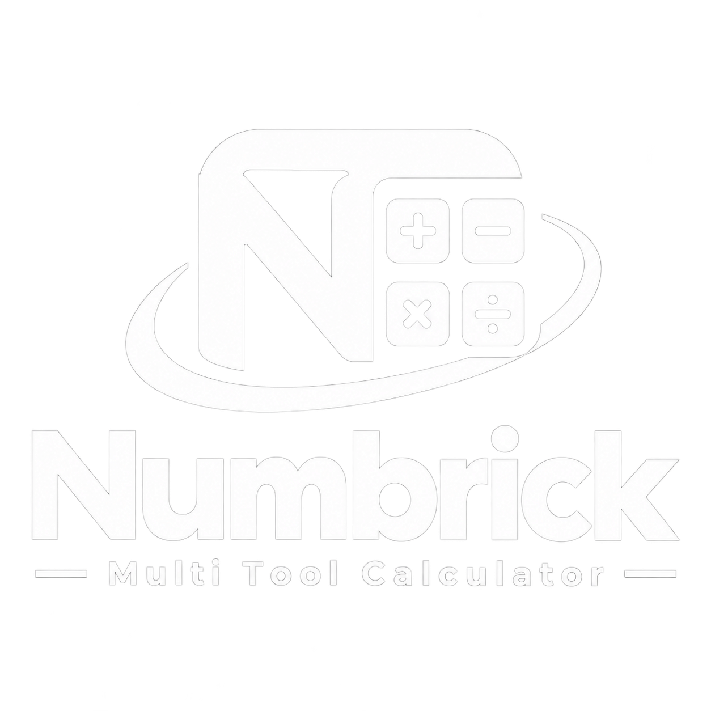
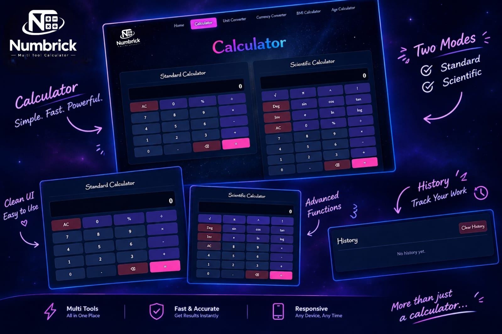
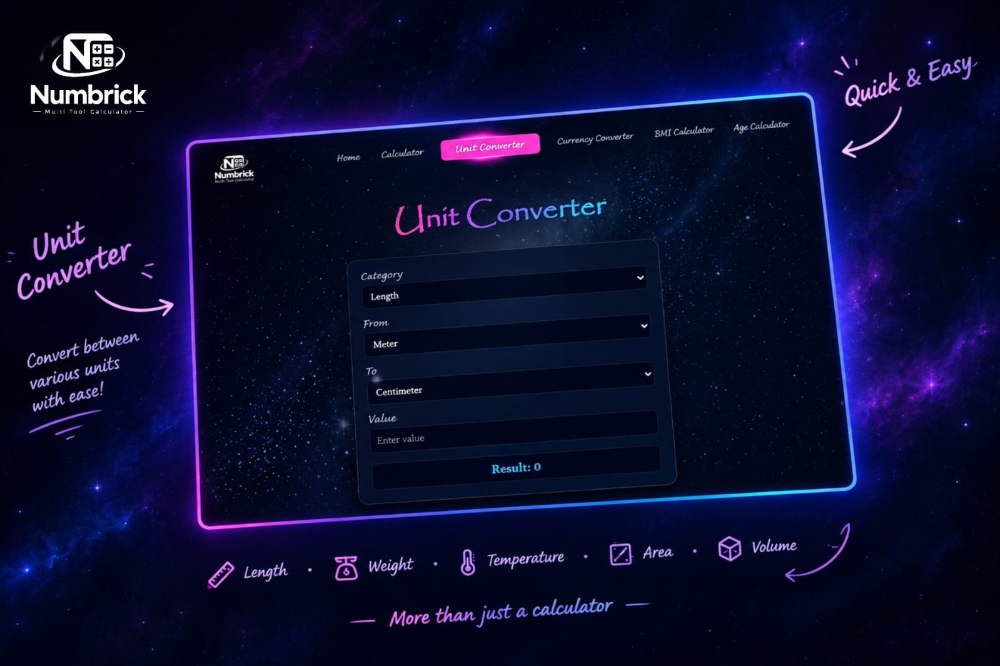
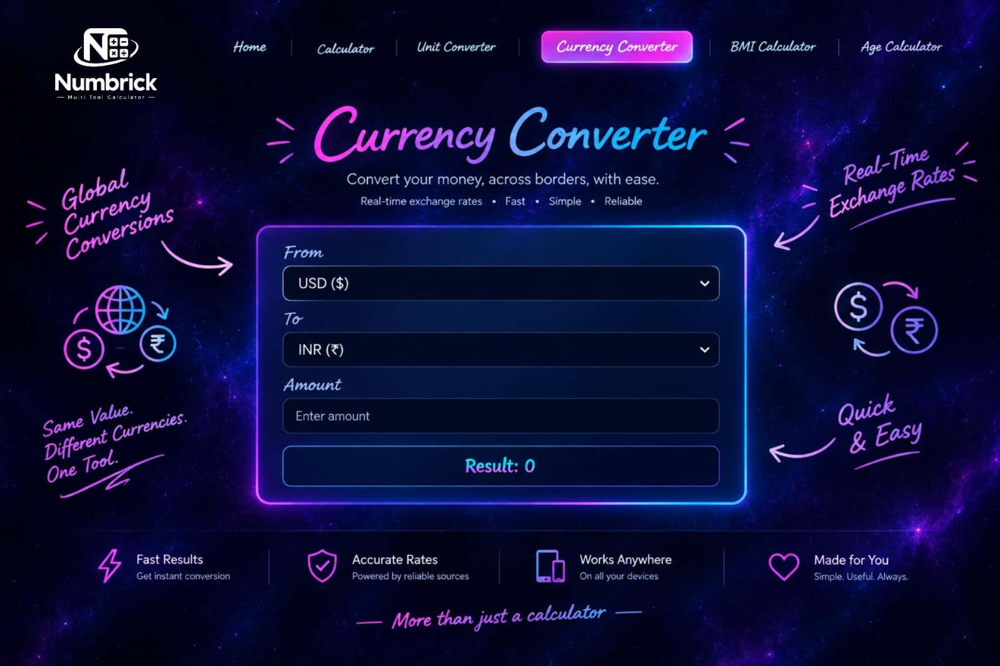
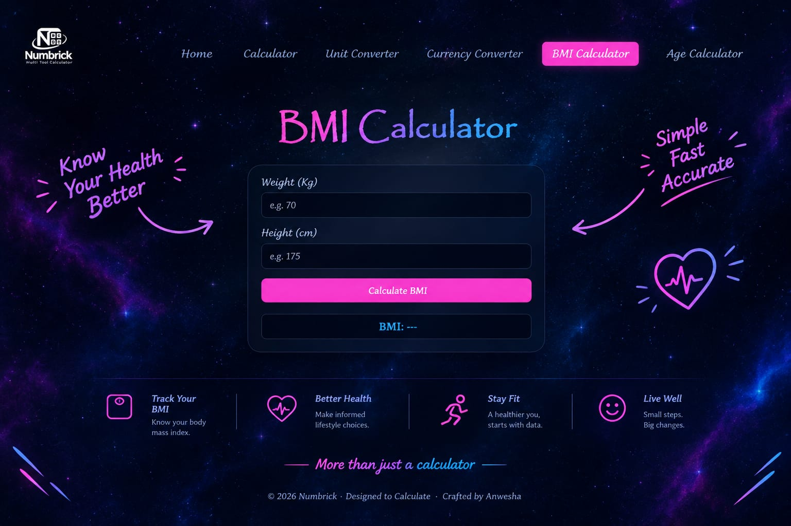
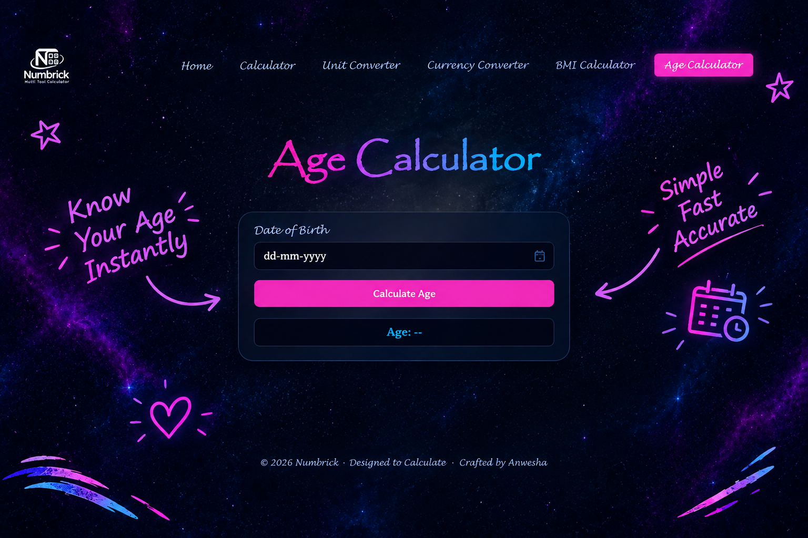

<div align="center">



---
<h1 align="left">🌌 Numbrick - Smart Calculation Suite</h1>

<p align="center">
  <b><i>Calculate • Convert • Simplify.</i></b>
</p>

**A modern digital workspace built to make everyday numbers easier to work with.**

<br>

<a href="[https://aiwithanwesha.github.io/Numbrick/](https://aiwithanwesha.github.io/Numbrick-by-Anwesha/)">
  
</a>


</div>

---

## ✦ About Numbrick

Numbers are part of almost everything we do — from simple calculations and measurements to currency conversions and everyday personal utilities.

**Numbrick** brings these different numerical tools together into one clean and convenient digital workspace.

Instead of switching between different websites for different tasks, Numbrick provides a collection of practical tools in one place — designed with a simple interface, interactive elements, and a modern visual experience.

> **One workspace. Multiple ways to work with numbers.**

---

## ⚡ What You Can Do

<table>
<tr>
<td width="50%">

### 🧮 Calculator

Perform everyday arithmetic operations with a clean standard calculator and explore advanced mathematical operations through the scientific calculator.

</td>

<td width="50%">

### ✨ Calculation History

Keep track of previous calculations through the integrated calculation history feature.

</td>
</tr>

<tr>

<td width="50%">

### 📏 Unit Converter

Convert values across multiple categories including length, weight, temperature, area, volume, time, speed, and data.

</td>
  
<td width="50%">

### 💱 Currency Converter

Convert between supported currencies through a simple and easy-to-use interface.

</td>
</tr>

<tr>
<td width="50%">

### ⚖️ BMI Calculator

Calculate Body Mass Index using height and weight and view the corresponding BMI category.

</td>

<td width="50%">

### 🎂 Age Calculator

Enter a date of birth and calculate age in years, months, and days.

</td>
</tr>
</table>

---

## 🖥️ A Glimpse of Numbrick

### Home


### Calculator



### Unit Converter



### Currency Converter



### BMI Calculator



### Age Calculator




---

## 🎨 Designed With a Purpose

Numbrick is built around a simple design philosophy:

**Clean interface.  
Clear information.  
Useful tools.  
Less unnecessary complexity.**

The interface combines a dark space-inspired background with gradient accents, glass-style panels, interactive buttons, and responsive layouts.

---

## 🛠️ Built With

<div align="center">


</div>

### Core Technologies

| Technology | Purpose |
|---|---|
| **HTML5** | Page structure and content |
| **CSS3** | Layout, styling, animations and responsive design |
| **JavaScript** | Calculations, conversions and interactivity |
| **Font Awesome** | Interface icons |
| **Google Fonts** | Typography |

---

## 🗂️ Project Structure

```text

├── index.html
├── calc-view.html
├── unit-view.html
├── curr-view.html
├── bmi-view.html
├── age-view.html
│
├── style.css
├── script.js
│
├── logo.png
├── bg.jpg
│
├── screenshots/
│   ├── home.jpg
│   ├── calculator.jpg
│   ├── unit-converter.jpg
│   ├── currency-converter.jpg
│   ├── bmi-calculator.jpg
│   └── age-calculator.jpg
│
└── README.md
```

---

## ✦ Behind The Code

<div align="center">

Designed, developed, and maintained with ❤️ by **Anwesha**  

*• © 2026 Numbrick •*

</div>
